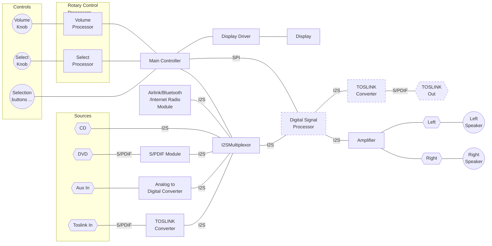
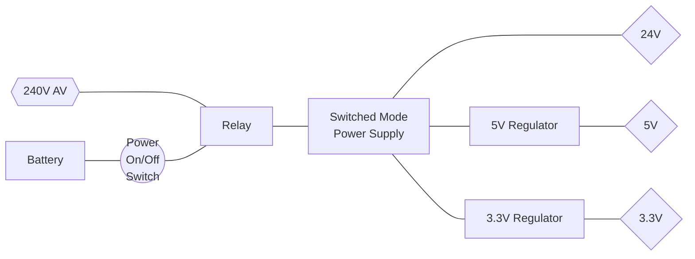
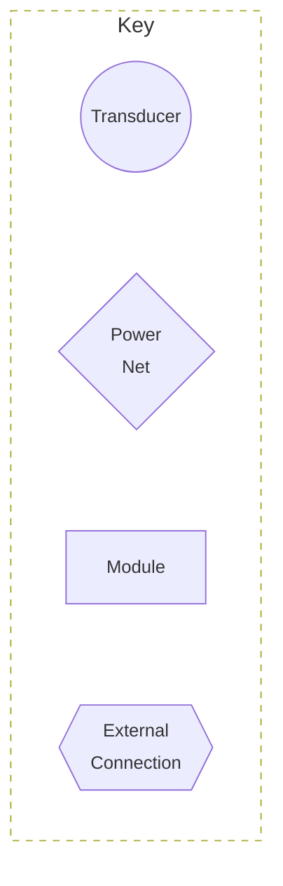

# Modular Audio Project - Amplifier Module

An class D amplifier module that can select other digital sources (I2S, S/PDIF).

## System Diagram

### Functional Components

### Power

### Symbols used in the Diagrams

<!--  -->

