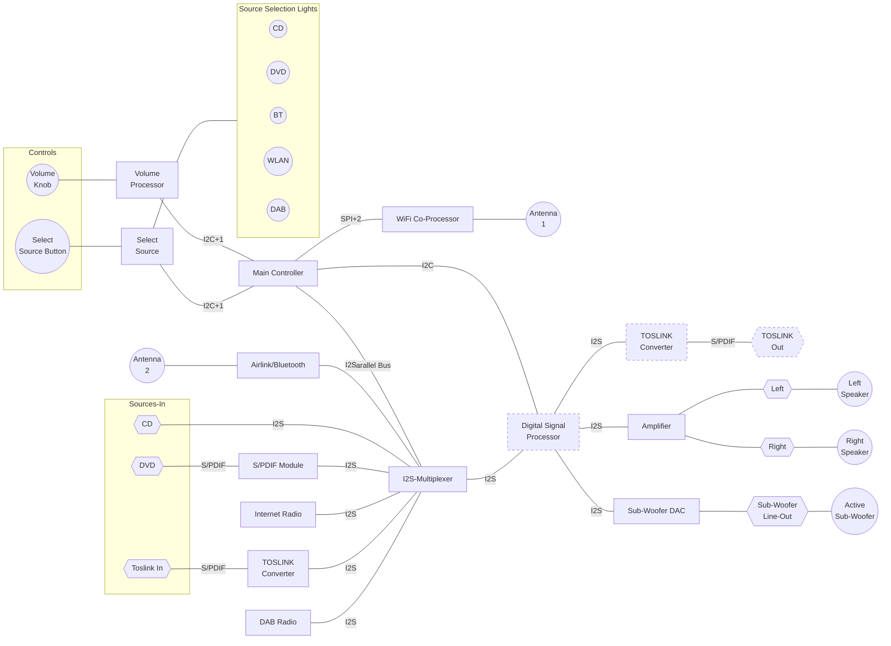
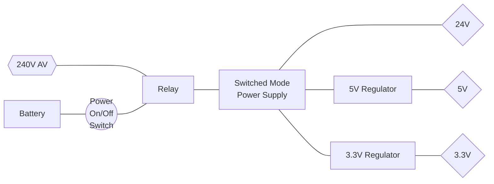
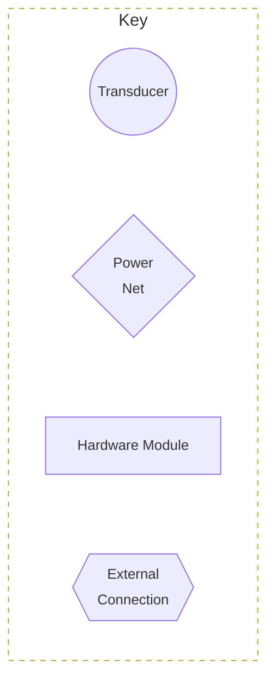

# Modular Audio Project - Amplifier Module

An class D amplifier module that can select other digital sources (I2S, S/PDIF).

## System Diagram

### Functional Components

<!-- Removed the ELK renderer as causing problems - see https://github.com/mermaid-js/mermaid-cli/issues/594 -->
<!-- Old code was (first line of the mermaid description): -->
<!-- %%{init: {"flowchart": {"defaultRenderer": "elk"}} }%% -->

### Power

### Symbols used in the Diagrams

<!--  -->

## Functional Component Descriptions

### Controller

Work in Progress!

The controller has the following tasks:

* Select sources
* Receive input fron the volume control and adjust the volume over the DSP. 
* Receive input from the button banks. These are used to interact with the display. 
* Interface with an (Airlift) Wifi board over an extended SPI interface. This is used to download station lists and also 
to control the internet radio module.

Software is [here](/software/main-controller).

Hardware is [here](/hardware/controller).
