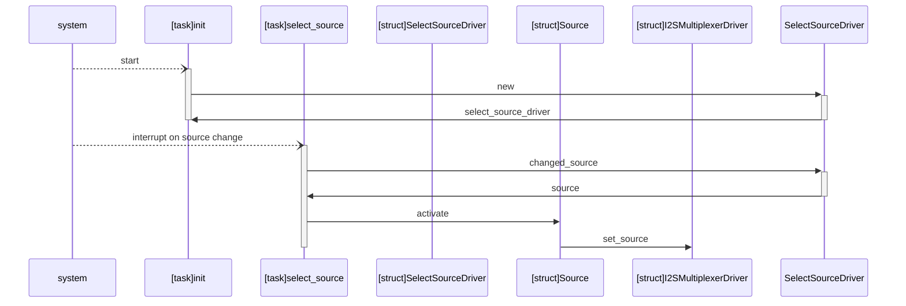

# Controller Sequence Diagram

```mermaid

sequenceDiagram

participant system
participant [task]init
participant [task]select_source
participant [struct]SelectSourceDriver
participant [struct]Source
participant [struct]I2SMultiplexerDriver

system--) [task]init : start
activate [task]init
[task]init->>+SelectSourceDriver: new
SelectSourceDriver->>-[task]init: select_source_driver
deactivate [task]init

system--)[task]select_source :  interrupt on source change
activate [task]select_source
[task]select_source->>+SelectSourceDriver : changed_source

SelectSourceDriver->>-[task]select_source : source
[task]select_source->>[struct]Source : activate

[struct]Source->>[struct]I2SMultiplexerDriver : set_source

deactivate [task]select_source


```
