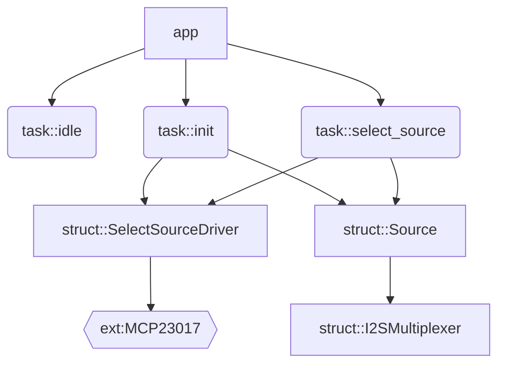

# Dependencies

```mermaid

flowchart TB
    idle(task::idle)
    init(task::init)
    select_source(task::select_source)
    SelectSourceDriver[struct::SelectSourceDriver]
    Source[struct::Source]
    I2SMultiplexer[struct::I2SMultiplexer]

    MCP23017{{ext:MCP23017}}

    app --> idle
    app --> init 
    init --> SelectSourceDriver
    init --> Source
    app --> select_source
    select_source --> SelectSourceDriver
    select_source --> Source
    SelectSourceDriver --> MCP23017
    Source --> I2SMultiplexer


```
