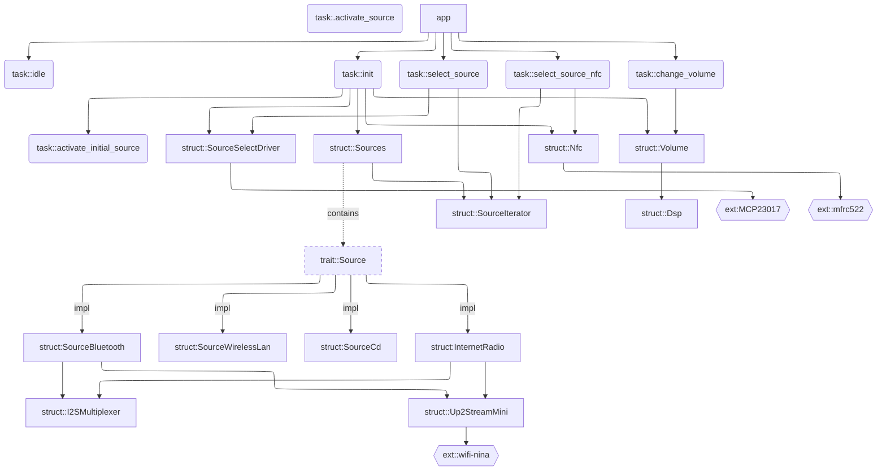

# Dependencies

```mermaid
%%{init: {"flowchart": {"defaultRenderer": "elk"}} }%%
flowchart TB
    %% ----- tasks -----
    idle(task::idle)
    init(task::init)
    select_source(task::select_source)
    select_source_nfc(task::select_source_nfc)
    change_volume(task::change_volume)
    activate_initial_source(task::activate_initial_source)
    actvate_source(task:.activate_source)
    
    %% ---- structs & traits ------- 
    SourceSelectDriver[struct::SourceSelectDriver]:::struct
    Sources[struct::Sources]:::struct
    SourceIterator[struct::SourceIterator]:::struct
    Source[trait::Source]:::trait
    I2SMultiplexer[struct::I2SMultiplexer]:::struct
    Up2StreamMini[struct::Up2StreamMini]:::struct
    nfc[struct::Nfc]:::struct
    volume[struct::Volume]:::struct
    dsp[struct::Dsp]:::struct

    %% ----- source structs ------- 
    SourceBluetooth[struct:SourceBluetooth]:::struct
    SourceWirelessLan[struct:SourceWirelessLan]:::struct
    SourceCd[struct:SourceCd]:::struct
    SourceInternetRadio[struct:InternetRadio]:::struct


    %% ------ external libraries ------ 
    MCP23017{{ext:MCP23017}}
    mfrc522{{ext::mfrc522}}
    wifi-nina{{ext::wifi-nina}}


    app --> idle
    app --> init 
    init --> activate_initial_source
    init --> SourceSelectDriver
    init --> Sources
    init --> volume
    init --> nfc

    Sources --> SourceIterator 

    app --> select_source
    select_source --> SourceSelectDriver
    select_source --> SourceIterator
    SourceSelectDriver --> MCP23017

    app--> select_source_nfc
    select_source_nfc --> SourceIterator
    select_source_nfc --> nfc --> mfrc522

    Sources -..->|contains| Source

    Source --->|impl| SourceBluetooth
    Source --->|impl| SourceWirelessLan
    Source --->|impl| SourceCd
    Source --->|impl| SourceInternetRadio


    SourceBluetooth --> I2SMultiplexer
    SourceBluetooth --> Up2StreamMini

    SourceInternetRadio --> I2SMultiplexer
    SourceInternetRadio --> Up2StreamMini
    
    Up2StreamMini  --> wifi-nina

    
    app-->change_volume
    volume-->dsp
    change_volume-->volume

    
    %%Class Defs%%
    classDef struct fill:tranparent
    classDef trait stroke-dasharray:5 5


```
