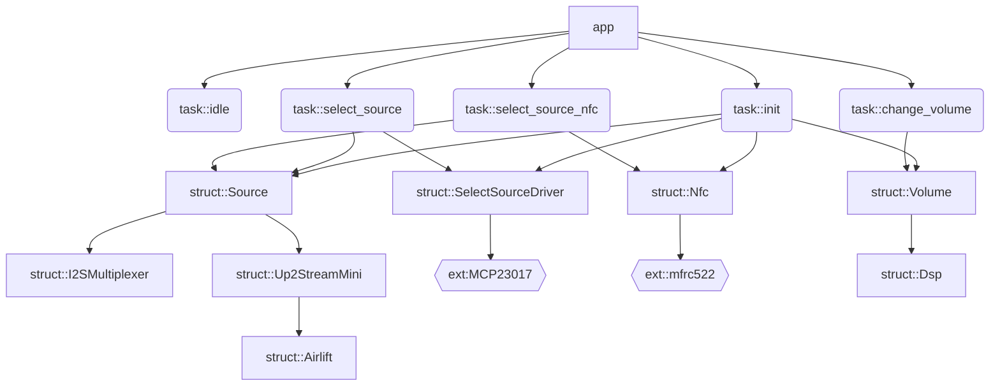

# Dependencies

```mermaid

flowchart TB
    %% ----- Components -----%%
    idle(task::idle)
    init(task::init)
    select_source(task::select_source)
    select_source_nfc(task::select_source_nfc)
    SelectSourceDriver[struct::SelectSourceDriver]
    Source[struct::Source]
    I2SMultiplexer[struct::I2SMultiplexer]
    Up2StreamMini[struct::Up2StreamMini]
    nfc[struct::Nfc]
    airlift[struct::Airlift]
    MCP23017{{ext:MCP23017}}
    mfrc522{{ext::mfrc522}}
    change_volume(task::change_volume)
    volume[struct::Volume]
    dsp[struct::Dsp]


    app --> idle
    app --> init 
    init --> SelectSourceDriver
    init --> Source
    init --> volume
    init --> nfc

    app --> select_source
    select_source --> SelectSourceDriver
    select_source --> Source
    SelectSourceDriver --> MCP23017

    app--> select_source_nfc
    select_source_nfc --> Source
    select_source_nfc --> nfc --> mfrc522

    Source --> I2SMultiplexer
    Source --> Up2StreamMini  --> airlift
    
    app-->change_volume
    volume-->dsp
    change_volume-->volume


```
