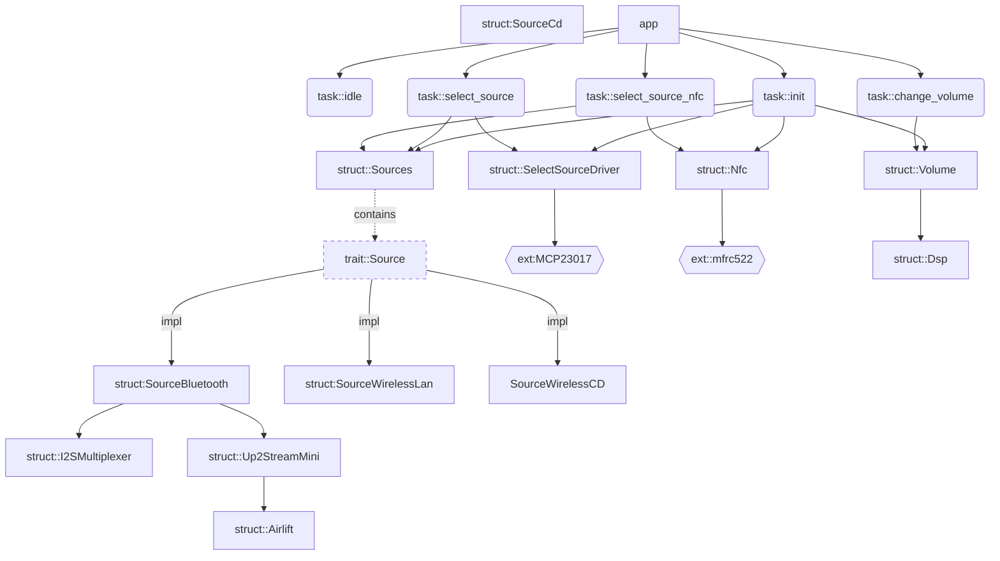

# Dependencies

```mermaid

flowchart TB
    %% ----- Components -----%%
    idle(task::idle)
    init(task::init)
    select_source(task::select_source)
    select_source_nfc(task::select_source_nfc)
    SelectSourceDriver[struct::SelectSourceDriver]:::struct
    Sources[struct::Sources]:::struct
    Source[trait::Source]:::trait
    I2SMultiplexer[struct::I2SMultiplexer]:::struct
    Up2StreamMini[struct::Up2StreamMini]:::struct
    nfc[struct::Nfc]:::struct
    airlift[struct::Airlift]:::struct
    MCP23017{{ext:MCP23017}}
    mfrc522{{ext::mfrc522}}
    change_volume(task::change_volume)
    volume[struct::Volume]:::struct
    dsp[struct::Dsp]

    SourceBluetooth[struct:SourceBluetooth]:::struct
    SourceWirelessLan[struct:SourceWirelessLan]:::struct
    SourceCd[struct:SourceCd]:::struct

    app --> idle
    app --> init 
    init --> SelectSourceDriver
    init --> Sources
    init --> volume
    init --> nfc

    app --> select_source
    select_source --> SelectSourceDriver
    select_source --> Sources
    SelectSourceDriver --> MCP23017

    app--> select_source_nfc
    select_source_nfc --> Sources
    select_source_nfc --> nfc --> mfrc522

    Sources -.->|contains| Source

    Source --->|impl| SourceBluetooth
    Source --->|impl| SourceWirelessLan
    Source --->|impl| SourceWirelessCD


    SourceBluetooth --> I2SMultiplexer
    SourceBluetooth --> Up2StreamMini  --> airlift
    
    app-->change_volume
    volume-->dsp
    change_volume-->volume

    
    %%Class Defs%%
    classDef struct fill:tranparent
    classDef trait stroke-dasharray:5 5


```
