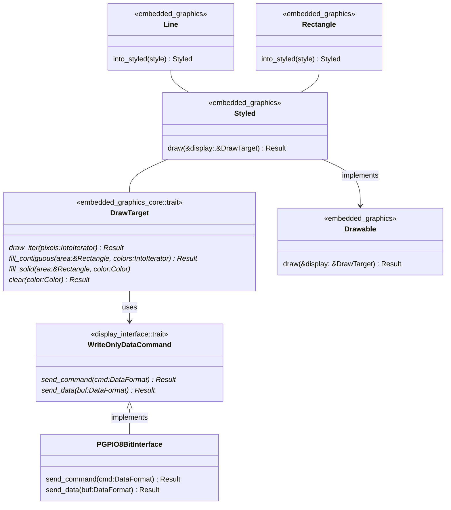

# Notes 
`PGPIO8BitInterface` is for the 8080 style interface to the display and is a [crate](https://docs.rs/display-interface-parallel-gpio/latest/display_interface_parallel_gpio/struct.PGPIO8BitInterface.html) in its own right