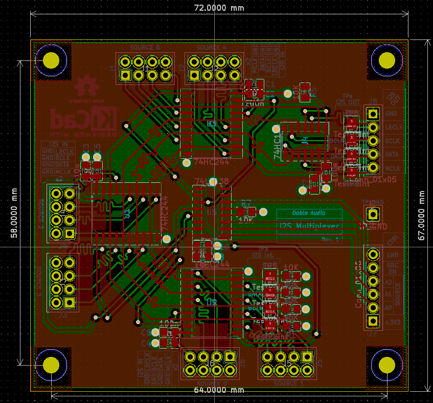

# I2S Multiplexer

This module routes I2S signals up to 6 sources to the amplifier module  - see the [module overview](../../README.md).

The design principles are:

* Each I2S signal (BCLK, LRCLK, DATA, MCLK) belonging to source are routed through the same buffers so has to minimise differences in buffer propagation delays and with it, differences in the relative timing of the signals with one another. 
* Each I2S signal belonging to a source have the the same track length - gain to moinimisd differences in the relative timing of the signals with one another. 

## Control Signals 

| Signal     | Description |
| ---------- | ----------- |
| A0, A1, A2 | Address of the source required. Only addresses from 0x0 to 0x5 are allowed. If another address is given the behaviour is not defined. |
| SRC_EN | This should be set LOW before changing  A0..2 and HIGH again once they have been set. | 

## Power

The board requires 3.3 Volt.

## Schematic

Schematic done with [KiCad 6](https://www.kicad.org/) and all files are in this format. An image of the schmematic is:

## PCB Layout 

PCB layout is done with [KiCad 6](https://www.kicad.org/)and all files are in this format. An image of the PCB layout is:

